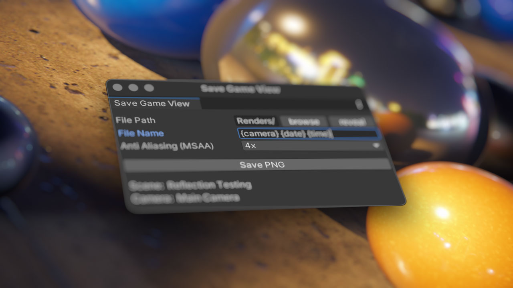

# VF Save Game View

Save PNG files from the Unity editor both in and out of play mode, using either a standalone render panel or camera-attached script.

## Installation

- Download the package
- Import into Unity
- Open the `Tools > Vectorform > Save Game View` panel, or attach `SaveCameraView` to a camera object
- Set the desired settings and click `Save PNG`

## Features

- Capture the game view in the editor without entering play mode
- Can be used as a UI panel or as a script attached to a camera
- Save PNG images with alpha, with two setup requirements:
	- Camera background type must be set to `Solid Color` using black with 0% alpha
	- Post processing must be disabled or modified to maintain alpha ([URP doesn't by default](https://forum.unity.com/threads/transparent-rendertexture-with-postprocessing.1265873/) [[archive link](https://web.archive.org/web/20231109115119/https://forum.unity.com/threads/transparent-rendertexture-with-postprocessing.1265873/)])
- Use dynamic variables in the file name for automated outputs
	- `{scene}` = the name of the currently open scene
	- `{camera}` = the name of the first active camera (SaveGameView) or attached camera (SaveCameraView)
	- `{samples}` = the selected multi-sampling level
	- `{date}` = the current date in YYYY-MM-DD format
	- `{time}` = the current time in HH-MM-SS.F format

## Debugging

- If you get the error "no active camera found in the scene view" even though an active camera exists, make sure it's tagged as "mainCamera" in the Inspector.

## Credits

Many thanks to the original inspiration [Snapscreen by Mufalder](https://github.com/Mufalder/unity-snapscreen), along with code for the directory browse/reveal UI setup.

## Notes

- Basic testing performed in Unity 2021.3 and 2022.1, should work in other versions
- This was development by a member of the design department as an internal tool only, and does not reflect the quality or standards of the Vectorform engineering department
- No warranty is provided, use at your own risk